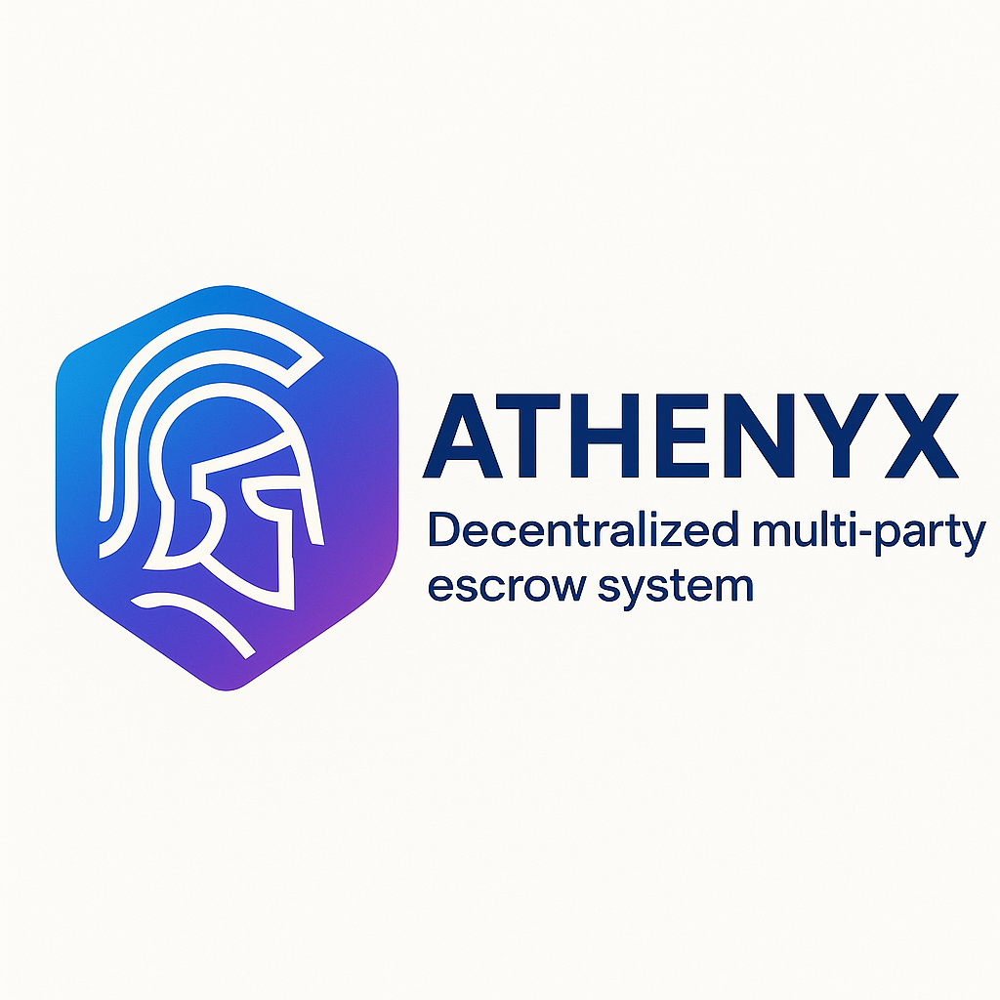

<div align="center">

<!-- LOGO PLACEHOLDER -->


# Athenyx Protocol

**Decentralized Multi-Party Escrow & Credit System with Byzantine-Resistant Guarantor Network**

[](https://soliditylang.org/)
[](https://opensource.org/licenses/MIT)
[](https://hardhat.org/)
[](https://openzeppelin.com/)

[Documentation](#documentation) • [Architecture](#architecture) • [Features](#features) • [Getting Started](#getting-started)

</div>

---

## 🌟 Overview

**Athenyx** is a next-generation decentralized protocol that solves the trust problem in peer-to-peer lending through a sophisticated multi-tier guarantor system, Byzantine fault-tolerant coordination mechanisms, and game-theoretic incentive alignment.

Inspired by ancient Spartan collective accountability and modern cryptographic consensus, Athenyx creates a self-enforcing credit ecosystem where:

- 🛡️ **Borrowers** gain access to capital through social collateral
- 💰 **Lenders** earn competitive returns with multi-layered risk mitigation
- 🤝 **Guarantors** build reputation capital and earn protocol rewards
- ⚖️ **Arbiters** resolve disputes with cryptoeconomic security

---

## 🎯 Core Problems Solved

### 1. Moral Hazard
Traditional lending suffers from information asymmetry. Athenyx uses staked guarantors with progressive liability to ensure borrower accountability.

### 2. Coordination Failure (Byzantine Generals Problem)
Guarantors could collude with borrowers. Our commit-reveal scheme with time-locked verifications prevents collusion while maintaining privacy.

### 3. Adverse Selection
Bad borrowers drive out good ones. Athenyx's on-chain reputation system and tiered interest rates create proper risk pricing.

### 4. Lender Risk Aversion
Why lend in a trustless environment? Multi-layered protection (guarantors + insurance pool + reputation) with attractive yields.

---

## 🏗️ Architecture

### Smart Contract System

```
┌─────────────────────────────────────────────────────────────┐
│                     Athenyx Protocol                        │
├─────────────────────────────────────────────────────────────┤
│                                                             │
│  ┌─────────────────┐         ┌──────────────────┐         │
│  │  AthenyxCore    │◄────────┤ GuarantorRegistry│         │
│  │  (Escrow Logic) │         │ (Reputation)     │         │
│  └────────┬────────┘         └──────────────────┘         │
│           │                                                │
│           ├──────────┬──────────────┬──────────────┐       │
│           ▼          ▼              ▼              ▼       │
│  ┌────────────┐ ┌─────────┐ ┌──────────┐ ┌────────────┐  │
│  │  Lender    │ │Insurance│ │ Dispute  │ │  NFT       │  │
│  │ Incentives │ │  Pool   │ │Arbitration│ │ Ownership  │  │
│  └────────────┘ └─────────┘ └──────────┘ └────────────┘  │
│                                                             │
└─────────────────────────────────────────────────────────────┘
```

### Multi-Tier Guarantor System

```
        Lender (Capital Provider)
               ↓
    ┌──────────────────────────┐
    │  Primary Guarantors      │
    │  • 3-5 individuals       │
    │  • 20-30% stake each     │
    │  • First loss position   │
    └──────────┬───────────────┘
               ↓
    ┌──────────────────────────┐
    │  Secondary Guarantors    │
    │  • Back primary layer    │
    │  • 10-15% stake each     │
    │  • Second loss position  │
    └──────────┬───────────────┘
               ↓
         Borrower (Capital Receiver)
```

---

## ✨ Features

### 🔐 Byzantine-Resistant Guarantor Verification

**Commit-Reveal Scheme**:
1. Guarantors commit `hash(address, secret, loanId)` on-chain
2. After commitment window closes, all reveal simultaneously  
3. System detects collusion if duplicate secrets appear
4. Time-locked random verification checks ensure availability

**Result**: Trustless coordination without central authority

---

### 🎮 Game-Theoretic Incentive Design

**Nash Equilibrium for Honesty**:

| Action | Borrower Repays | Borrower Defaults |
|--------|----------------|-------------------|
| **Honest Guarantor** | ✅ Stake + Reputation + Rewards | ⚠️ Partial Loss + Whistleblower Bonus |
| **Colluding Guarantor** | 💰 Small Bribe | ❌ Total Loss + Reputation Destroyed + Future Ban |

**Dominant Strategy**: Be honest, because `Value(Future Reputation) > Current Gains from Collusion`

---

### 📊 Dynamic Risk-Based Pricing

```javascript
Interest Rate = Base Rate (5%)
              + Risk Premium (0-15%)
              + Early Lender Bonus (0.5%)
              - Reputation Discount (0-3%)

Risk Premium calculated from:
• Borrower reputation score
• Number & quality of guarantors  
• Loan-to-value ratio
• Historical default rates
```

---

### 🛡️ Multi-Layer Protection for Lenders

**Layer 1 - Primary Guarantors**: 
- Stake 20-30% of loan amount
- First to lose in default scenario

**Layer 2 - Secondary Guarantors**:
- Stake 10-15% of loan amount  
- Activated if primary layer fails

**Layer 3 - Insurance Pool**:
- 10% of all interest payments
- Covers 50-100% of losses based on guarantor performance

**Layer 4 - Reputation System**:
- Failed borrowers/guarantors publicly marked
- Cannot participate for cooldown period (90-180 days)

---

### 🏆 Reputation Mining System

**Build Trust, Earn Value**:

```
Successful Loan Completion:
├─ Borrower: +15 reputation
├─ Primary Guarantors: +10 reputation + 0.1% protocol fee share
└─ Secondary Guarantors: +5 reputation

Reputation Benefits:
├─ Lower interest rates (up to 3% discount)
├─ Access to larger loans
├─ Reduced guarantor stake requirements
└─ Governance voting power (future)

Reputation Penalties:
├─ Default: -50 reputation + 90-day ban
├─ Collusion detected: -100 reputation + permanent ban
└─ Failed guarantee: -30 reputation + 30-day ban
```

---

### ⚡ Milestone-Based Disbursement

Borrowers don't receive lump sums. Funds released in milestones:

```
Loan: $10,000 over 6 months

Milestone 1: $2,000 (Month 1) → Requires approval
Milestone 2: $3,000 (Month 3) → Requires approval  
Milestone 3: $5,000 (Month 6) → Requires approval

Each milestone requires:
✓ Payer approval (on-chain or EIP-712 signature)
✓ Deadline not passed (or seller claim)
✓ Sufficient funds in escrow
```

---

### 🔄 NFT-Based Ownership Transfer

Each escrow is an **ERC-721 NFT**:

- Seller can transfer rights to another party
- New owner inherits milestone release privileges  
- Enables secondary markets for future cash flows
- Transparent ownership history on-chain

---

## 🚀 Getting Started

### Prerequisites

```bash
node >= 18.0.0
npm >= 9.0.0
```

### Installation

```bash
# Clone the repository
git clone https://github.com/your-org/athenyx.git
cd athenyx

# Install dependencies
npm install

# Compile contracts
npm run compile
```

### Running Tests

```bash
# Run all tests
npm test

# Run with coverage
npm run test:coverage

# Run specific test file
npx hardhat test test/Athenyx.test.js
```

### Local Deployment

```bash
# Start local Hardhat node (Terminal 1)
npm run node

# In another terminal, deploy contracts (Terminal 2)
npm run deploy:local

# Interact with deployed contracts (Terminal 3)
npm run interact
```

---

## 📖 Documentation

### For Borrowers

**How to request a loan**:

1. **Determine loan parameters**:
   - Amount needed
   - Repayment timeline  
   - Milestone breakdown

2. **Find guarantors** (optional):
   - Primary: 3-5 trusted individuals with good reputation
   - Secondary: Additional safety layer

3. **Submit loan request**:
   ```javascript
   const tx = await athenyx.createEscrow(
     sellerAddress,
     arbiterAddress,
     arbiterFee,
     milestoneAmounts,
     milestoneDeadlines,
     requiresGuarantors, // true if you want guarantors
     minGuarantorCount,
     { value: totalAmount }
   );
   ```

4. **If guarantors required**:
   - Each guarantor commits their stake
   - Commit-reveal process prevents collusion
   - Activate escrow with lender

5. **Receive funds & repay milestones**

---

### For Lenders

**How to lend capital**:

1. **Register as lender**:
   ```javascript
   await lenderIncentives.registerLender();
   ```

2. **Place loan offer**:
   ```javascript
   await lenderIncentives.placeLoanOffer(
     escrowId,
     interestRateBasisPoints, // e.g., 750 = 7.5%
     { value: loanAmount }
   );
   ```

3. **Wait for borrower to accept**

4. **Receive repayments**:
   - Milestone-based (reduces risk)
   - Principal + interest
   - Protected by guarantors & insurance

---

### For Guarantors

**How to become a guarantor**:

1. **Register**:
   ```javascript
   await guarantorRegistry.registerGuarantor();
   ```

2. **Build reputation**:
   - Start as secondary guarantor
   - Complete successful guarantees
   - Earn reputation points

3. **Commit to loans**:
   ```javascript
   const secret = ethers.randomBytes(32);
   const hash = ethers.keccak256(
     ethers.solidityPacked(
       ["address", "bytes32", "uint256"],
       [yourAddress, secret, escrowId]
     )
   );
   
   await guarantorRegistry.commitAsGuarantor(
     escrowId,
     1, // GuarantorTier.PRIMARY
     stakeAmount,
     hash,
     { value: stakeAmount }
   );
   ```

4. **Reveal after commitment period**:
   ```javascript
   await guarantorRegistry.revealCommitment(escrowId, secret);
   ```

5. **Earn rewards**:
   - Stake returned + reputation boost
   - Protocol fee share
   - Access to better opportunities

---

### For Arbiters

**Dispute resolution process**:

1. **Wait for dispute escalation**
2. **Review evidence** (off-chain + on-chain)
3. **Make ruling**:
   ```javascript
   await athenyx.resolveDispute(
     escrowId,
     [0, 1] // Release milestones 0 and 1 to seller
   );
   ```
4. **Receive arbiter fee** (paid automatically from escrow)

---

## 🔧 Configuration

### Economic Parameters

```javascript
// Reputation System
MIN_REPUTATION_TO_GUARANTEE = 100
REPUTATION_GAIN_PER_SUCCESS = 10
REPUTATION_LOSS_PER_FAIL = 50
REPUTATION_RECOVERY_TIME = 90 days

// Stake Requirements
MIN_STAKE_PERCENTAGE = 10%
MAX_STAKE_PERCENTAGE = 30%
PRIMARY_GUARANTOR_COUNT = 3-5
SECONDARY_GUARANTOR_COUNT = 2-4

// Interest Rates
BASE_RATE = 5% annual
RISK_PREMIUM_RANGE = 0-15%
EARLY_BIRD_BONUS = 0.5%

// Insurance Pool
INSURANCE_FEE = 10% of interest
INSURANCE_PAYOUT_RATIO = 50-100%

// Timeouts
COMMITMENT_WINDOW = 48 hours
REVEAL_WINDOW = 24 hours
DISPUTE_PERIOD = 7 days
```

---

## 🛠️ Development Roadmap

### ✅ Phase 1: Core Protocol (Complete)
- [x] Multi-party contributions
- [x] Milestone-based releases
- [x] EIP-712 signatures
- [x] NFT ownership
- [x] Dispute resolution
- [x] Guarantor registry
- [x] Commit-reveal scheme
- [x] Insurance pool
- [x] Lender incentives
- [x] 25 comprehensive tests

### 📋 Phase 2: Standard & Modularity (Current)
- [ ] Refactor to modular architecture
- [ ] Create EIP draft
- [ ] NPM package publication
- [ ] Developer documentation

### 🔮 Phase 3: Advanced Features (Future)
- [ ] DAO governance
- [ ] Cross-chain bridges
- [ ] Privacy layers (zk-SNARKs)
- [ ] Credit score oracles
- [ ] Mobile SDK

---

## 🔒 Security

### Audits

- [ ] Internal security review (Q2 2025)
- [ ] External audit by [Firm Name] (Q3 2025)
- [ ] Bug bounty program (Immunefi) - Coming soon

### Security Best Practices

- ✅ ReentrancyGuard on all state-changing functions
- ✅ Custom errors for gas efficiency
- ✅ Checks-Effects-Interactions pattern
- ✅ No delegatecall usage
- ✅ SafeERC20 for token transfers
- ✅ Time-locks on critical operations

**Report vulnerabilities**: security@athenyx.protocol

---

## 📊 Economic Model

### Protocol Revenue

```
Revenue Streams:
├─ Origination Fee: 0.5% of loan amount (borrower pays)
├─ Arbitration Fee: 2% of disputed amount (escrow pays)
├─ Late Payment Fee: 1% per week overdue
└─ Insurance Pool Surplus: Redistributed to protocol treasury

Revenue Allocation:
├─ 50% → Insurance pool reserves
├─ 30% → Guarantor rewards
├─ 15% → Protocol development
└─ 5% → DAO treasury
```

---

## 🤝 Contributing

We welcome contributions! Please see [CONTRIBUTING.md](./CONTRIBUTING.md) for guidelines.

### Development Setup

```bash
# Fork the repo
git clone https://github.com/your-username/athenyx.git

# Create feature branch
git checkout -b feature/amazing-feature

# Make changes and test
npm test

# Commit with conventional commits
git commit -m "feat: add amazing feature"

# Push and create PR
git push origin feature/amazing-feature
```

---

## 📄 License

This project is licensed under the MIT License - see the [LICENSE](LICENSE) file for details.

---

## 🌐 Links

- **Documentation**: Coming soon
- **Discord**: Coming soon
- **Twitter**: Coming soon

---

<div align="center">

**Built with ❤️ by the Athenyx Team**

*Trustless lending through cryptoeconomic security*

</div>
